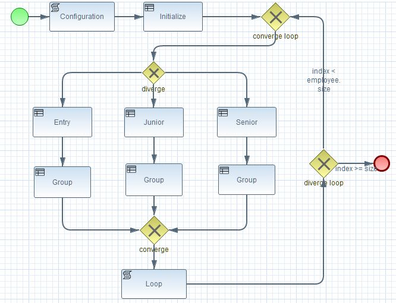
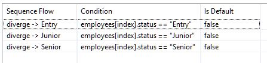
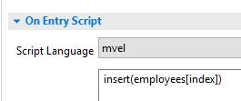
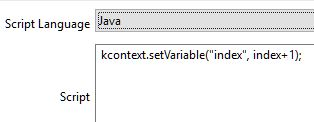
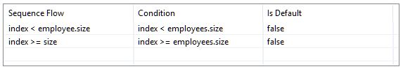

<p align='right'>
<small>Sunil Samuel<br>
web_github@sunilsamuel.com<br>
http://www.sunilsamuel.com
</small>
</p>

<font size="8">**<p align='center'><font size="8" color="red">BPMN Loop</p>**</font>

# Overview

A sample application that uses BPMN to illustrate the following:

* Process Variables in Rule :: Create a process variable within the BRMS rule
* Looping in BPMN :: Using process variables to loop a list of objects

The following BPMN process is used for this example.


# Process Variables in Rule

Process variables are used as variables within the BPMN process for scripting and as 
conditional statements within the tasks.  There are several ways to insert a process 
variable into the process instance.  This is an example where the rule via the drl file 
is used to insert the process variable.

The first task of this BPMN process is the `Configuration` Script Task.  This task insert 
the `ProcessInstance` object into the knowledge session using the following script Java 
code:

```java
kcontext.getKieRuntime().insert(kcontext.getProcessInstance());
```

Next, the `Initialize` Business Task will insert the variable into the knowledge session:

```java
package com.sunilsamuel.bpmn.bpmn_brms_diverge;
import org.kie.api.runtime.process.WorkflowProcessInstance;


import java.util.List
import java.util.ArrayList
import com.sunilsamuel.bpmn.bpmn_brms_diverge.Employee

query "get_employees" ()
    $employees: List() from collect(Employee())
end


rule "Initialize All Entry"
ruleflow-group "Initialize"
when
    $process : WorkflowProcessInstance()
then
    List employees = new ArrayList<Employee>();
    employees.add (new Employee ("Person1",100,"Entry","A"));
    employees.add (new Employee ("Person2",200,"Junior","C"));
    employees.add (new Employee ("Person3",300,"Senior","B"));
    employees.add (new Employee ("Person4",400,"Entry","C"));
    employees.add (new Employee ("Person5",500,"Junior","A"));
    employees.add (new Employee ("Person6",600,"Senior","B"));
    $process.setVariable("employees",employees);
    Integer index = new Integer(0);
    $process.setVariable("index",index);
    retract($process);
end
```

This rule essentially selects the `WorkflowProcessInstance` object that was inserted 
by the `Configuration` task.  The `$process.setVariable()` method is used to insert 
two variables, the `employees` list and the `index` of type `Integer` initialized to 
0.  This is to indicate that we will process the 0th element from the employees list 
continue to process the rest.

# Looping in BPMN

Sometimes it is necessary to loop within the BPMN process so that all of the objects
within a list can be processed.  For instance, if there is List of `Customer` objects 
where several tasks are performed against it, then we would need to loop thru the elements 
within this list.

This is done by keeping track of the total number of elements within the list and the 
current index that is being processed.  To add on to the complexity of this process, 
we'll add an Exclusive OR (XOR) gateway that process the object given different paths. 
The path is determined by conditions for each branch.

To create this loop, you would almost always have a `converging gateway` in a 
close proximity to a `diverging gateway` at the top.  The conditions for the `diverge` 
gateway uses the `index` process variable we inserted earlier as follows:


Now, the `On Entry Script` for the Script tasks (`Entry, Junior, and Senior`) will insert using 
mvel, the object that the index is pointing to into the working memory, as follows:


At this point, the rules have access to the object that it needs to process.

At the end, the `Script Tag` named `Loop` will increment the index by 1 using Java as 
the code, as follows:


Finally, the `diverge loop` at the end will check to see if the index is larger than 
the size of the list.  It it is, then branch to end otherwise go back to the `converge 
loop`.  The condition is as follows:



